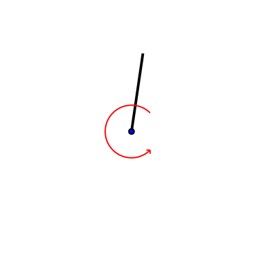
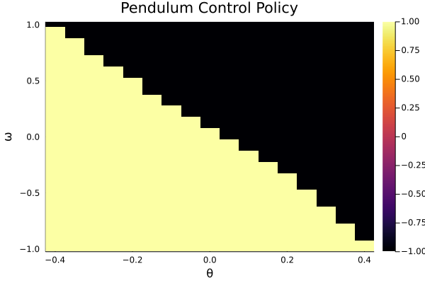
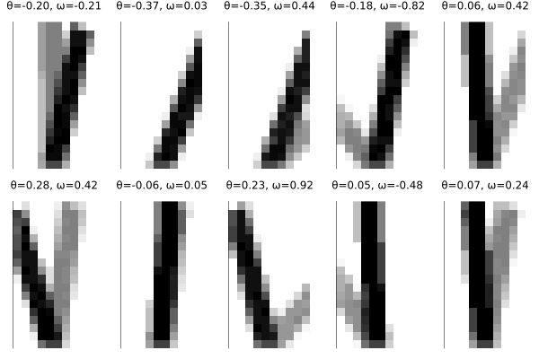
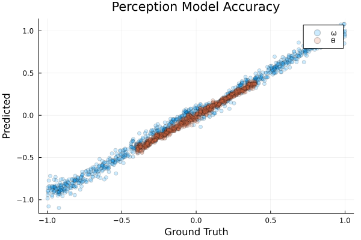
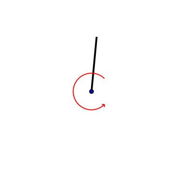
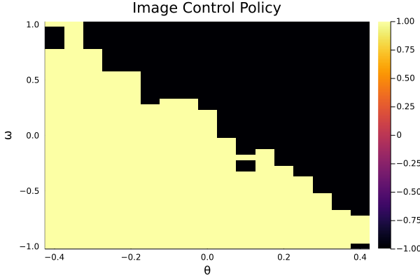

# Risk Sensitive Perception

## Dependencies
To run this code you will need to add the following unregistered julia packages
* https://github.com/ancorso/POMDPGym.jl
* https://github.com/ancorso/Crux.jl

## Pendulum Example
Our initial toy problem will be the control of an inverted pendulum from images. The file `inverted_pendulum/demo.jl` goes through the basics of training a simple controller and perception system and evaluating the trained agent. 

#### Controller
The controller was trained using Proximal Policy Optimization on the 2D pendulum state and has the resulting behavior and policy map. The controller is stored in `inverted_pendulum/controllers/`

#### Perception System
To train a perception system, we generate pendulum images with the corresponding state, creating a dataset that looks like the following:

We train a simple MLP that has one hidden layer with 64 units and get the following distribution of prediction errors. The model is stored in `inverted_pendulum/perception/`

#### Combined System
We can now concatenate the perception system with the controller to construct the combined agent. The behavior and policy map of the combined agent is shown below.

